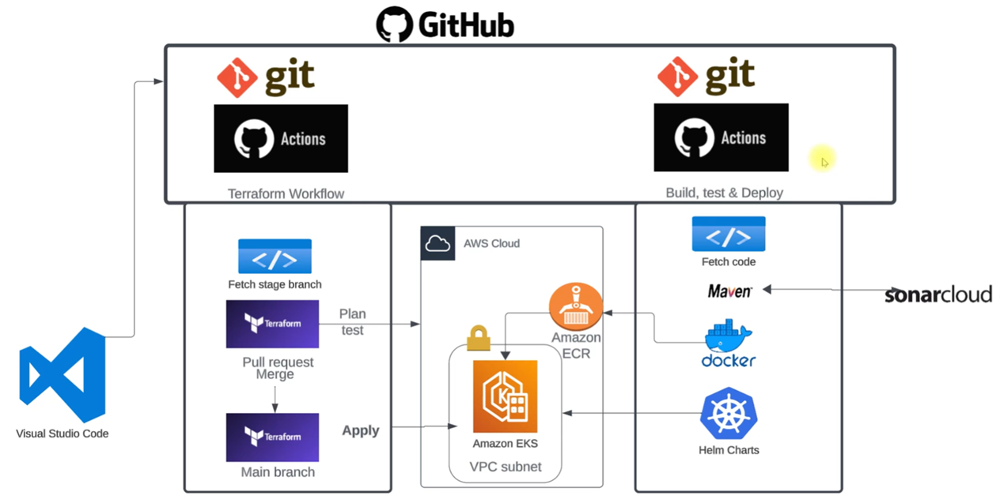
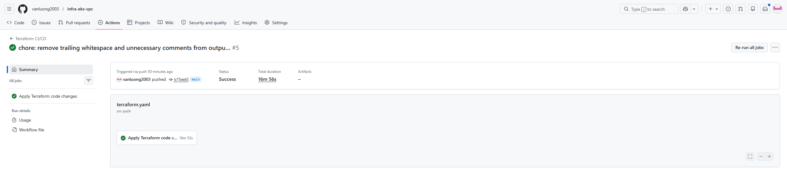
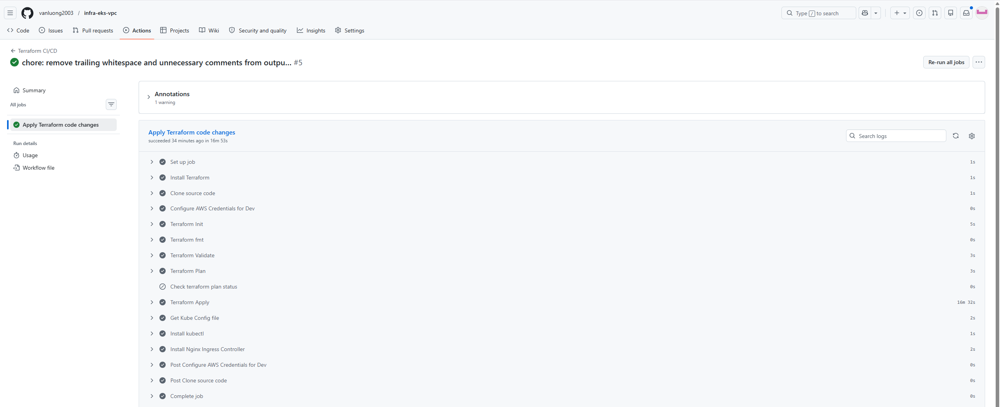
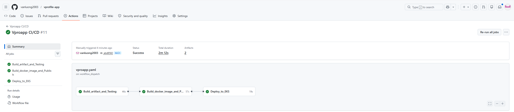
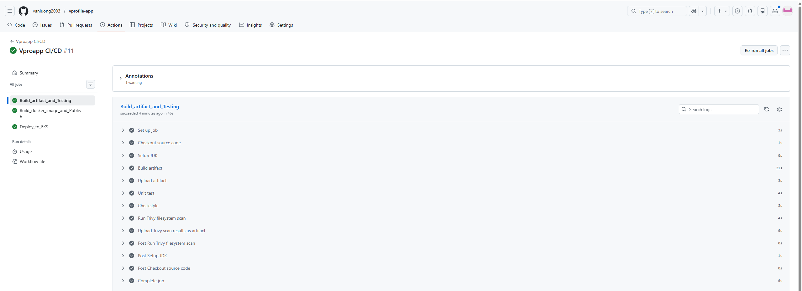
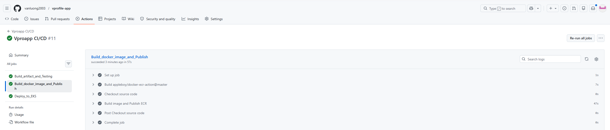
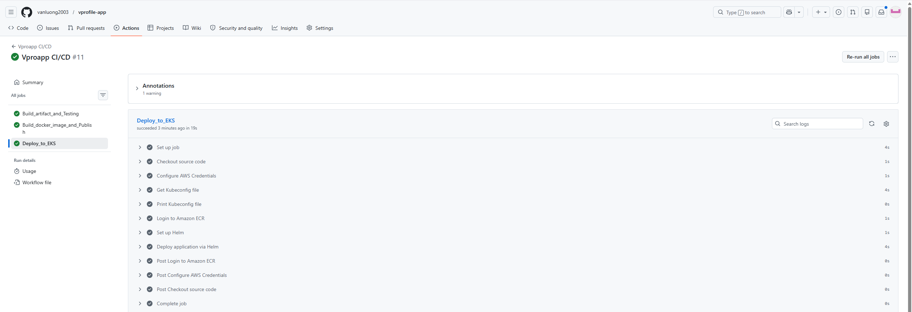
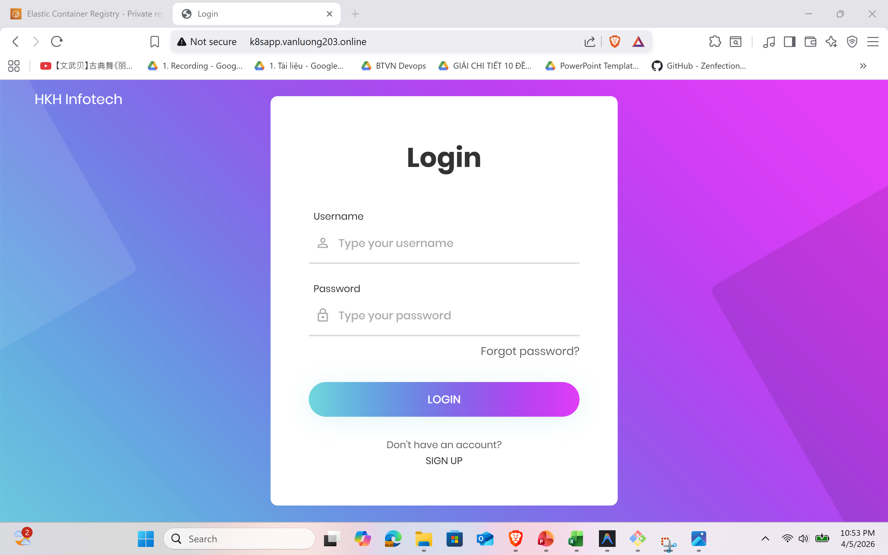
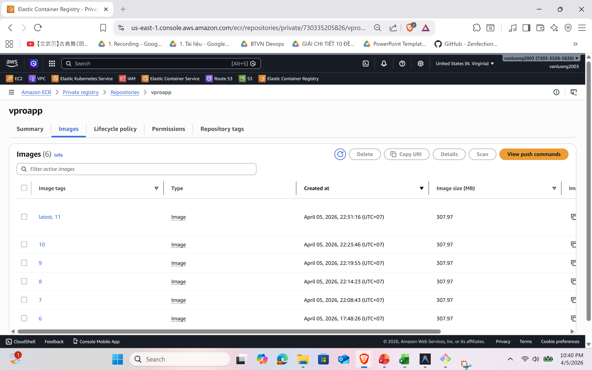
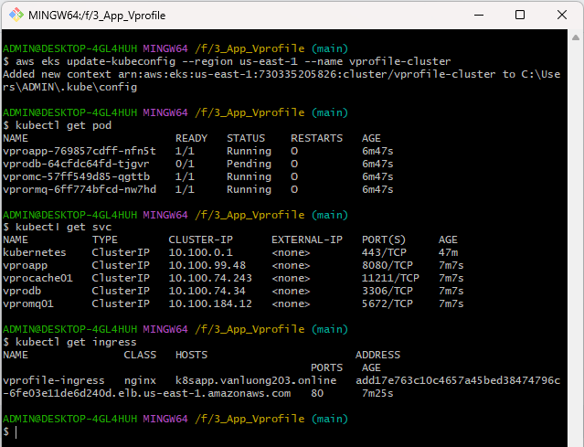

# GitOps — Infrastructure & Application Delivery on AWS EKS

Production-grade GitOps pipeline automating infrastructure provisioning, container image lifecycle, and Kubernetes deployments — all driven by Git.

<p align="center">
  
  
  
  
  
  
  
  
</p>

---

## Architecture

<p align="center">
  
</p>

The system is composed of two independent, event-driven pipelines managed via separate GitHub repositories:

- **Infrastructure Pipeline** — Terraform provisions VPC, EKS, and networking on AWS
- **Application Pipeline** — Builds, tests, scans, containerizes, and deploys the app to EKS via Helm

---

## Tech Stack

| Category | Technology | Purpose |
|----------|-----------|---------|
| Infrastructure as Code | Terraform + AWS Provider v5.25 | Provision VPC, EKS, networking |
| CI/CD | GitHub Actions | Automate build, test, scan, deploy |
| Containerization | Docker | Package application as OCI images |
| Container Registry | Amazon ECR | Store Docker images |
| Orchestration | Amazon EKS (Kubernetes v1.31) | Run containerized workloads |
| Package Manager | Helm v3 | Template and deploy K8s manifests |
| Security Scanning | Trivy (Aqua Security) | Scan for OS & library CVEs |
| State Management | AWS S3 + DynamoDB | Remote Terraform state with locking |
| Ingress | Nginx Ingress Controller | Route external traffic into cluster |
| Application | Java (JDK 21) + Maven | Multi-tier web app (Vprofile) |

---

## Pipeline Details

### Infrastructure Pipeline — Terraform CI/CD

**Trigger:** Push to `main`/`stage` (on `*.tf` / `*.tfvars` changes), Pull Requests, or manual dispatch.

```
Init → Fmt Check → Validate → Plan → Apply (main only) → Kubeconfig Update → Ingress Install
```

Key points:
- `terraform apply` only executes on the `main` branch — protects production from accidental changes
- Plan failure halts the pipeline with explicit status checks
- Remote state on S3 with bucket versioning for team collaboration
- Post-apply automatically configures kubeconfig and installs Nginx Ingress Controller

<details>
<summary>Screenshots — Infrastructure Workflow</summary>
<br>
<p align="center">
  
  <br><em>Terraform Init, Validate & Plan</em>
</p>
<p align="center">
  
  <br><em>Terraform Apply & Post-Deploy</em>
</p>
</details>

---

### Application Pipeline — Vproapp CI/CD

**Trigger:** Manual dispatch (`workflow_dispatch`).

Three-stage pipeline with explicit job dependencies:

**Stage 1 — Build & Test**
- Maven build (JDK 21) → Upload `.war` artifact
- Unit tests + Checkstyle analysis
- Trivy filesystem scan → Upload report

**Stage 2 — Docker Build & Push**
- Build Docker image from custom Dockerfile
- Tag with `latest` + `run_number`
- Push to Amazon ECR

**Stage 3 — Deploy to EKS**
- Configure AWS credentials + update kubeconfig
- `helm upgrade --install` with dynamic image tag

Key points:
- Failing tests block deployment — each stage depends on the previous one
- Dual image tagging (`latest` + build number) enables both rolling updates and exact rollbacks
- Trivy scan results are uploaded as pipeline artifacts for audit

<details>
<summary>Screenshots — Application Workflow</summary>
<br>
<p align="center">
  
  <br><em>Stage 1 — Build, Test & Security Scan</em>
</p>
<p align="center">
  
  <br><em>Stage 2 — Docker Build & ECR Push</em>
</p>
<p align="center">
  
  <br><em>Stage 3 — Helm Deploy to EKS</em>
</p>
<p align="center">
  
  <br><em>Full Pipeline Run — All Stages Passed</em>
</p>
</details>

---

## Infrastructure as Code

### Resources Provisioned

| Resource | Configuration |
|----------|--------------|
| VPC | `172.20.0.0/16`, DNS hostnames enabled |
| Public Subnets | 3 subnets across 3 AZs, tagged for ELB |
| Private Subnets | 3 subnets across 3 AZs, tagged for internal ELB |
| NAT Gateway | Single NAT (cost-optimized) |
| EKS Cluster | v1.31, public API endpoint |
| Node Group 1 | `t3.small` × 2 (min:1 / max:3) |
| Node Group 2 | `t3.small` × 1 (min:1 / max:2) |
| S3 Backend | Remote state with versioning |

### File Structure

```
3_Test_Terraform/
├── providers.tf          # AWS provider + S3 backend
├── variables.tf          # Input variables (region, cluster name)
├── vpc.tf                # VPC, subnets, NAT via terraform-aws-modules
├── eks.tf                # EKS cluster + managed node groups
├── outputs.tf            # Exported values
└── .github/workflows/
    └── terraform.yaml    # CI/CD pipeline
```

---

## Kubernetes & Helm Chart

The application is deployed as a multi-tier stack using a custom Helm chart (`vprochart`):

| Component | Manifests |
|-----------|-----------|
| App (Tomcat) | `app-deployment.yaml`, `app-service.yaml` |
| Database (MySQL) | `db-deployment.yaml`, `db-service.yaml`, `db-pvc.yaml` |
| Cache (Memcached) | `mc-deployment.yaml`, `mc-service.yaml` |
| Queue (RabbitMQ) | `rmq-deployment.yaml`, `rmq-service.yaml` |
| Ingress | `ingress.yaml` |
| Secrets | `secret.yaml` |

```bash
helm upgrade --install vprostack ./vprochart \
  --namespace default \
  --set image.repository=<ECR_URI>/vproapp \
  --set image.tag=<BUILD_NUMBER>
```

---

## Security

| Layer | Implementation |
|-------|---------------|
| Pipeline Secrets | AWS credentials in GitHub Secrets, never hardcoded |
| Vulnerability Scanning | Trivy scans on every build |
| Network Isolation | Workloads in private subnets behind NAT Gateway |
| Image Tagging | Immutable build-number tags prevent tag mutation |
| State Security | Terraform state in encrypted S3 bucket |
| K8s Secrets | Sensitive data managed via Kubernetes Secrets |

---

## Screenshots

<details>
<summary>Application UI</summary>
<br>
<p align="center">
  
  <br><em>Vprofile Application running on EKS</em>
</p>
</details>

<details>
<summary>ECR Repository</summary>
<br>
<p align="center">
  
  <br><em>Docker images stored in Amazon ECR</em>
</p>
</details>

<details>
<summary>kubectl Verification</summary>
<br>
<p align="center">
  
  <br><em>All services running healthy</em>
</p>
</details>

---

## Getting Started

### Prerequisites

- AWS Account with IAM credentials
- GitHub Secrets: `AWS_ACCESS_KEY_ID`, `AWS_SECRET_ACCESS_KEY`, `AWS_REGISTRY`
- Terraform CLI, kubectl, Helm (for local development)

### Deploy Infrastructure

```bash
terraform init -backend-config="bucket=vprofile-tfstate-bucket-001"
terraform plan -out planfile
terraform apply planfile
```

Or push to `main` branch for automated deployment via GitHub Actions.

### Deploy Application

```bash
# Via GitHub Actions (recommended):
# Actions tab → Vproapp CI/CD → Run workflow

# Manual:
aws eks update-kubeconfig --name vprofile-cluster --region us-east-1
helm upgrade --install vprostack ./vprochart \
  --set image.repository=<ECR_URI>/vproapp \
  --set image.tag=latest
```

---

## Lessons Learned

| Challenge | Solution |
|-----------|---------|
| EKS nodes failing to join cluster | Fixed private subnet NAT Gateway routing and K8s subnet tags |
| Terraform state conflicts | Migrated to S3 backend with DynamoDB locking |
| Helm upgrade failing on first run | Used `helm upgrade --install` with `--create-namespace` |
| Trivy scan blocking pipeline | Set `exit-code: 0` for advisory mode while still capturing results |

---

## Author

DevOps Engineer focused on building scalable, automated, and secure cloud-native delivery platforms.

**Core skills:** Terraform · Kubernetes · Docker · CI/CD · AWS · GitOps · Helm · IaC · Linux